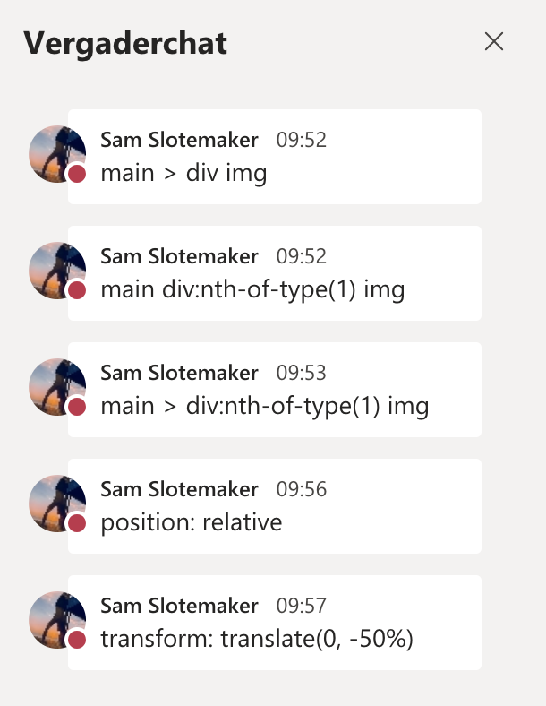
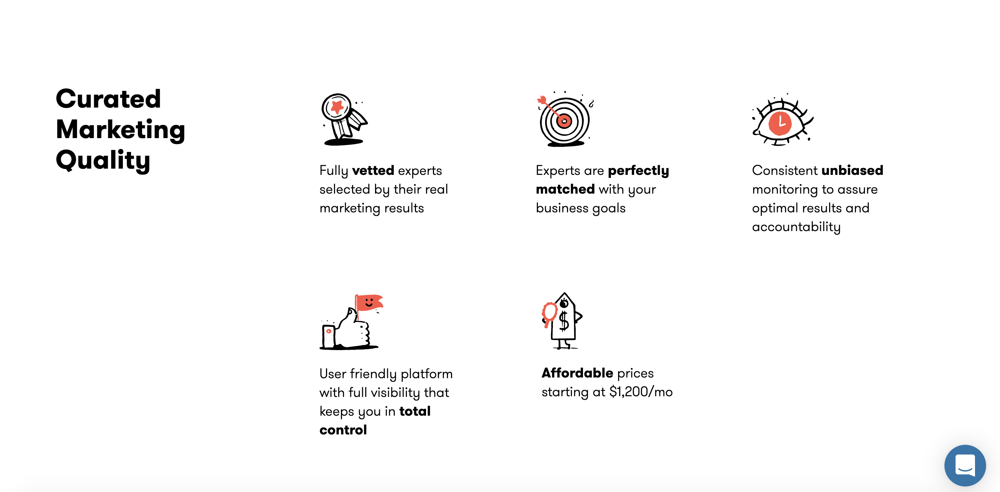
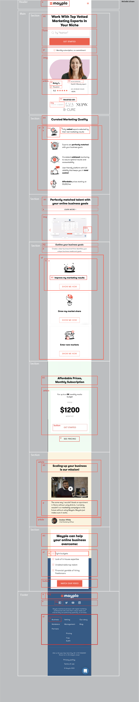

# Procesverslag
**Auteur:** -jouw naam-

Markdown cheat cheet: [Hulp bij het schrijven van Markdown](https://github.com/adam-p/markdown-here/wiki/Markdown-Cheatsheet). Nb. de standaardstructuur en de spartaanse opmaak zijn helemaal prima. Het gaat om de inhoud van je procesverslag. Besteedt de tijd voor pracht en praal aan je website.

## Bronnenlijst
1. -bron 1-
2. -bron 2-
3. -...-

## Eindgesprek (week 7/8)

-dit ging goed & dit was lastig-

**Screenshot(s):**

-screenshot(s) van je eindresultaat-

## Voortgang 3 (week 6)

Agenda 212-a
Carousel met overflow-x: scroll: 
Hartje dat vult als je er op klikt 
Mag button hover in javascript? Of moet het in CSS
Uitklapbaar menu

## Voortgang 2 (week 5)

Agenda 212-a
Carrousel (css/html of js, beste optie?) 
Css image slider animation 
Text responsive maken- fluid typografie of @mediaQueries? 
:hover bug (Jelle)
slider van tekst en dingen toevoegen in winkelmandje (Ysabella)

Het gaat best goed. Alle problemen van de vorige voortgang zijn opgelost en ik heb een tweede pagina erbij. Ik zou me graag meer willen focusesen op het surface plane maken van de website. 

## Voortgang 1 (week 3)

### Stand van zaken

Ik vond het tot nu toe best goed gaan. Ik heb het meeste moeite met het aanspreken van de elementen in CSS. Ik merk dat ik al snel werk met classes, terwijl het ook anders kan. Verder heb ik nog moeite met als er veel elementen in een kleine ruimte staan. 

**Screenshot(s):**

### Agenda voor meeting

Hoe kan ik CSS verbeteren?
Hoe kan ik op een andere manier een carrousel maken?

### Verslag van meeting

Ik kan css verbeteren door gebruik te maken van:

## Intake (week 1)

**Je startniveau:** -blauw-

**Je focus:** -surface plane-

**Je opdracht:** https://www.mayple.com/

**Screenshot(s):**

**Breakdown-schets(en):**

